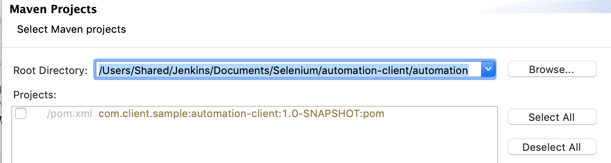

# Eclipse

## Download Eclipse

* [https://www.eclipse.org/downloads/eclipse-packages/](https://www.eclipse.org/downloads/eclipse-packages/)
* Download Eclipse IDE for Java Developers

## Launch Automation Project Through Eclipse

* Open eclipse
* Select File → Import → Maven → Import existing maven project
* Select Next
* Root Directory: Select the automation project folder
* Select the project

* Select finish

## Download TestNG Plugin

* Select Help -&gt; Eclipse Marketplace
* Search for Testng
* Install and restart

## Disable Refresh Using Native Hooks Or Polling

* Select Eclipse -&gt; Preferences -&gt; Workspace
* Deselect "Refresh using native hooks or polling"
* This is important, so as to not get stuck in build loop from code generation and code change detection

### Install Plugin Manually

* If the TestNG plugin is not found in the eclipse market place:
* Go to url [http://dl.bintray.com/testng-team/testng-eclipse-release//](http://dl.bintray.com/testng-team/testng-eclipse-release//)
* Go to latest TestNG version link
* Copy the url of the version. eg. [http://dl.bintray.com/testng-team/testng-eclipse-release/6.14.3/](http://dl.bintray.com/testng-team/testng-eclipse-release/6.14.3/)
* In Eclipse: Navigate: Help -&gt; Install New Software
* Paste the link in the work with field
* 

* Select Add
* Set Name: testNG
* Select testNG from the result and then Next
* 

* Security warning could be displayed. Install anyways
* Restart eclipse to apply changes
* TestNG plugin should now be installed

## Enable Annotations

* Right click on the project folder -&gt; properties -&gt; Java Compiler -&gt; Annotation Processing
* Enable "Enable Annotation Process"
* Set "Generated source directory" to "./target/generated-sources/annotations"
* Apply and Close
* 

## Select Package View

* Select Package Explorer → Package Presentation → Hierarchical
* 

## Verify The Setup

* Select login test from:
  * src → test → java → module -&gt; web -&gt; tests → VerifyLoginTest.java
  * Right click and select: Run As → TestNG Tests
  * 

* * Test should pass
  * 

