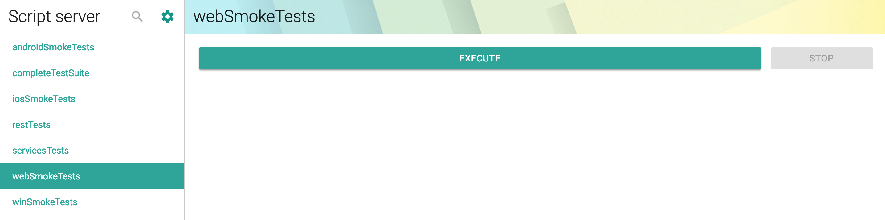

# Prerequisites

## An Integrated Development Environment

* You will need a modern IDE to work with Java
* [Eclipse](https://ehsan-matean.gitbook.io/automationcore/~/edit/drafts/-L_LG8F5yxhSdB1sjMGm/getting-started/ide/eclipse) or [Intellij](https://ehsan-matean.gitbook.io/automationcore/~/edit/drafts/-L_LG8F5yxhSdB1sjMGm/getting-started/ide/intellij) can be used

## JAVA 

####  Install Java on your computer

Download and install the **Java Software Development Kit \(JDK\)** [here](http://www.oracle.com/technetwork/java/javase/downloads/index.html)


* This JDK version comes bundled with Java Runtime Environment \(JRE\), so you do not need to download and install the JRE separately.
* Once installation is complete, open command prompt and type:

  * **java -version**

   If you see the following screen you are good to move to the next step

* ```
  $ java -version
  ```
* ```text
  java version "1.8.0_162"
  Java(TM) SE Runtime Environment (build 1.8.0_162-b12)
  Java HotSpot(TM) 64-Bit Server VM (build 25.162-b12, mixed mode)
  ```
* Command line, run command: **javac -version**
* ```text
  jenkins@[~/Documents/Selenium]$ javac -version
  javac 1.8.0_162
  ```

## Maven

### Automatic Download

* **Run autonomx -&gt; setup.sh/.bat to automatically downloaded maven locally**

### Download Manually

* or download manually:
  * You will also need [Maven 3.3.x or higher](https://maven.apache.org/download.cgi).
  * Download maven zip file



* Unzip to a directory

### Add to Environment 

#### Windows

* Go to Environment Variables 
* User "system variables", find Path variable and select edit
* Select new and enter the path to maven bin directory
* eg. c:\&lt;install location&gt;\apache-maven-3.6.1\bin
* Save and close
* Verify by opening command prompt and typing "mvn --version"

#### Mac

* Add maven path to bash profile:
*   ```text
  vim ~/.bash_profile
  ```

* Add path:
* ```bash
  export M2_HOME=/Users/someUser/apache-maven-3.6.1
  export PATH=$PATH:$M2_HOME/bin
  ```
* Save and close
  * press "shift + :" and type "wq!" to save
* Close and reopen the terminal
* Verify with "mvn --version"
* or you can use brew: 

  ```text
  brew install maven
  ```

